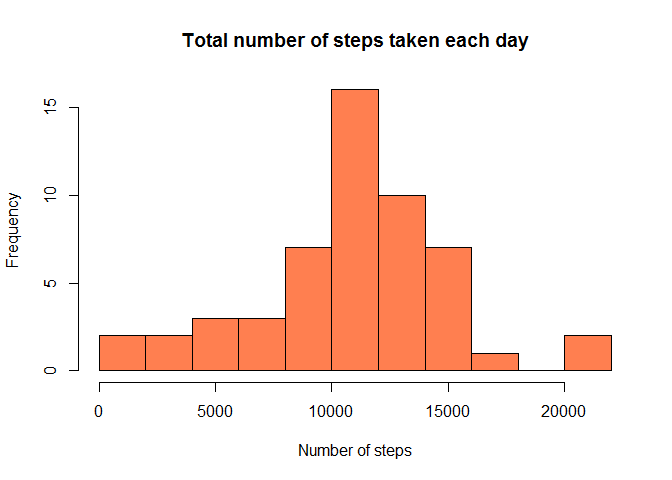
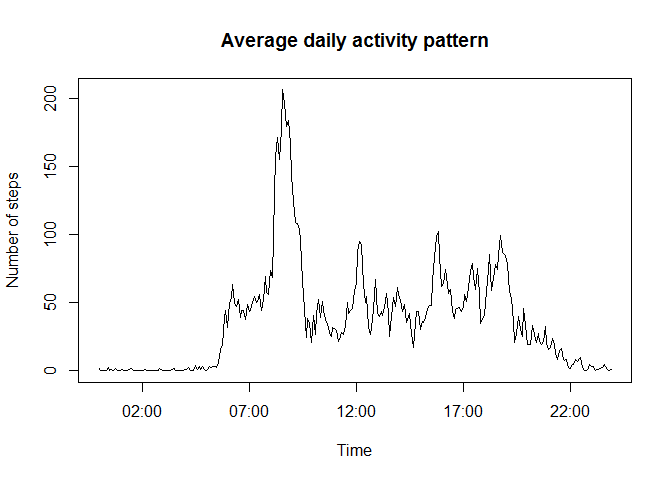
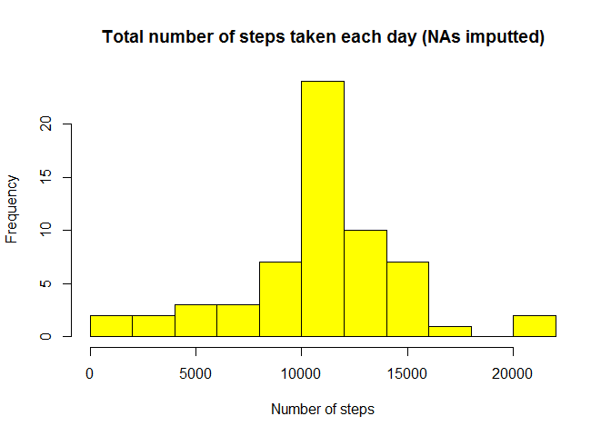
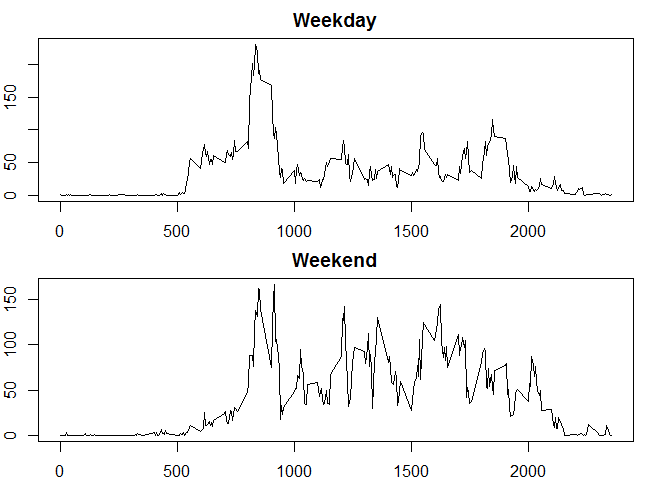

# Reproducible Research: Peer Assessment 1


## Loading and preprocessing the data
First unzip the archive, then read it.

```r
unzip("activity.zip", exdir = ".")
activity <- read.csv("activity.csv")
```

## What is mean total number of steps taken per day?
Calculate the sum of the number of steps taken each day (ignore NAs). Use date as a factor.  
Create a new dataframe that contains a vector of unique dates and a vector of
steps.  

```r
library(dplyr)
```

```
## Warning: package 'dplyr' was built under R version 3.2.1
```

```
## 
## Attaching package: 'dplyr'
## 
## The following objects are masked from 'package:stats':
## 
##     filter, lag
## 
## The following objects are masked from 'package:base':
## 
##     intersect, setdiff, setequal, union
```

```r
steps_per_day <- summarize(group_by(activity, date), steps = sum(steps,
                                                                 na.rm = T))
```
Here is the histogram of the total number of steps taken each day:

```r
hist(steps_per_day$steps, col = "coral", breaks = 10,
     main = "Total number of steps taken each day", xlab = "Number of steps",
     ylab = "Frequency")
```

 
  
The **mean** of the total number of steps taken each day is

```r
mean(steps_per_day$steps, na.rm = T)  ## NAs are simply removed, i.e. ignored
```

```
## [1] 9354.23
```
and the **median** is

```r
median(steps_per_day$steps, na.rm = T)
```

```
## [1] 10395
```

## What is the average daily activity pattern?
Use interval as a factor and average the dayly number of steps for each interval.

```r
activity_pattern <- summarize(group_by(activity, interval),
                              steps = mean(steps, na.rm = T))
```
Transform intervals into time of POSIX format. Store time in a new column.

```r
for(i in 1:which(activity_pattern$interval == 5)){
      activity_pattern[i,1] <- paste("0", as.character(activity_pattern[i,1]),
                                     sep = "")
}
for(i in 1:which(activity_pattern$interval == 55)){
      activity_pattern[i,1] <- paste("0", as.character(activity_pattern[i,1]),
                                     sep = "")
}
for(i in 1:which(activity_pattern$interval == 955)){
      activity_pattern[i,1] <- paste("0", as.character(activity_pattern[i,1]),
                                     sep = "")
}
activity_pattern$time <- strptime(as.character(activity_pattern$interval), "%H%M")
```
Plot the resulting average numbers of steps as a function of the time intervals.

```r
plot(activity_pattern$time, activity_pattern$steps, type = "l",
     main = "Average daily activity pattern", xlab = "Time",
     ylab = "Number of steps")
```

 
  
Find the **interval which contains the maximum number of steps**:

```r
max_label <- which(activity_pattern$steps == max(activity_pattern$steps))
max_interval <- activity_pattern[[1]][max_label]
max_interval  ## That's the one
```

```
## [1] "0835"
```

## Imputing missing values
`complete.cases` returns `FALSE` for the rows of the dataframe which contain
missing values.

```r
total_na_rows <- table(complete.cases(activity))
total_na_rows
```

```
## 
## FALSE  TRUE 
##  2304 15264
```
So, the **number of rows with missing values** is:

```r
total_na_rows[[1]]
```

```
## [1] 2304
```
Now replace missing values with the average numbers of steps for that interval.
Recall that these averages are already calculated and are stored in
`activity_pattern` in the 2nd column. The new dataset without missing values is
called `activity_new`.

```r
activity_new <- activity
for(i in 1:nrow(activity_new)){
      if(is.na(activity_new[i,1])){
            int_label <-
                  which(as.numeric(activity_pattern[[1]]) == activity_new[i,3])
            activity_new[i,1] <- activity_pattern[[2]][int_label]
      }
}
```
Calculate new total numbers of steps per day

```r
steps_per_day_new <- summarize(group_by(activity_new, date), steps = sum(steps))
```
And create the histogram of the total number of steps taken each day with
imputted NAs:

```r
hist(steps_per_day_new$steps, col = "yellow", breaks = 10,
     main = "Total number of steps taken each day (NAs imputted)",
     xlab = "Number of steps",
     ylab = "Frequency")
```

 
  
The **new mean** of the total number of steps taken each day is

```r
mean(steps_per_day_new$steps)
```

```
## [1] 10766.19
```
and the **new median** is

```r
median(steps_per_day_new$steps)
```

```
## [1] 10766.19
```
One can see that the new values of the mean and the median differ from the
initial ones. Interestingly, replacing the missing values with the means for the
corresponding intervals led to the values of mean and median being closer to
each other. In fact, with the given degree of precision they are equal. I believe
that the reason is as follows: on the initial histogram we can see that the
larger numbers of steps (right-hand side) occur more frequently. Thus, the portion
of large interval-averaged values we added is greated than that of the 
smaller ones.
  
## Are there differences in activity patterns between weekdays and weekends?
Transform `date` column into POSIXct class. Change local settings so that
weekdays have english abbreviations (mine are not in english by default).
Then create a new column with "weekday" and "weekend" strings and make this
column a factor.

```r
Sys.setlocale("LC_ALL", "English")
```

```
## [1] "LC_COLLATE=English_United States.1252;LC_CTYPE=English_United States.1252;LC_MONETARY=English_United States.1252;LC_NUMERIC=C;LC_TIME=English_United States.1252"
```

```r
activity_new$weekdays <- "weekday"
activity_new[(weekdays(strptime(activity_new$date, "%Y-%m-%d")) == "Saturday" |
         weekdays(strptime(activity_new$date, "%Y-%m-%d")) == "Sunday"),4] <- "weekend"
activity_new$weekdays <- as.factor(activity_new$weekdays)
```
Create two new dataframes (for weekdays and weekends) for the panel plot.

```r
activity_pattern_weekday <-
      summarize(group_by(activity_new[activity_new$weekdays == "weekday",],
                         interval), steps = mean(steps))
activity_pattern_weekend <-
      summarize(group_by(activity_new[activity_new$weekdays == "weekend",],
                         interval), steps = mean(steps))
```
Construct a panel plot containing a time series plot of the 5-minute interval
(x-axis) and the average number of steps taken, averaged across all weekday days
or weekend days (y-axis).

```r
par(mfrow = c(2,1), mar = c(2,2,2,2))
plot(activity_pattern_weekday$interval, activity_pattern_weekday$steps,
     type = "l", main = "Weekday", xlab = "Time interval",
     ylab = "Number of steps")
plot(activity_pattern_weekend$interval, activity_pattern_weekend$steps,
     type = "l", main = "Weekend", xlab = "Time interval",
     ylab = "Number of steps")
```

 
  
  *Thank you for attention!*
